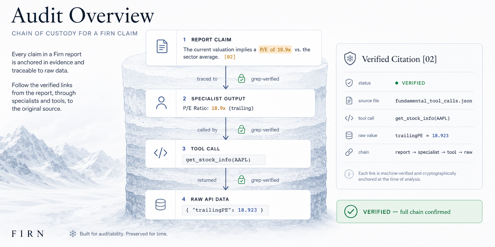
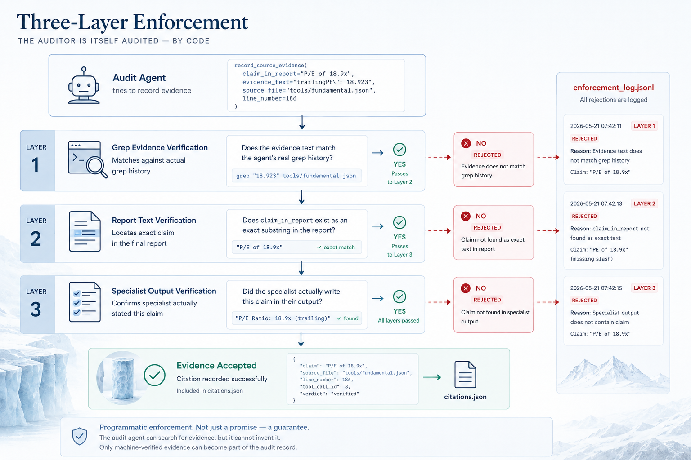
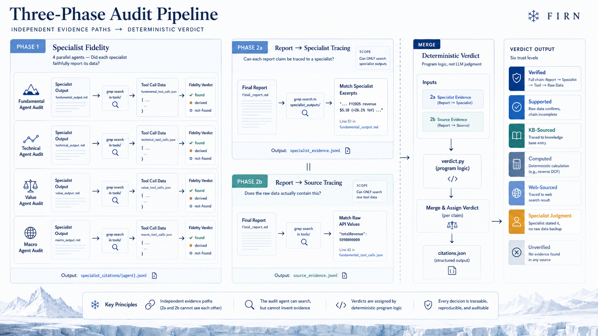
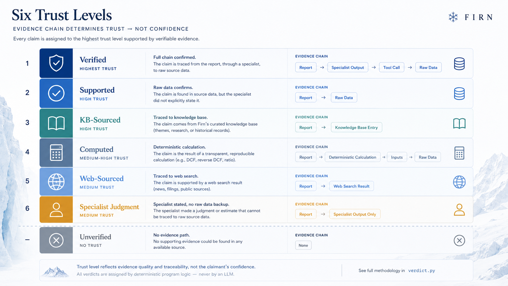
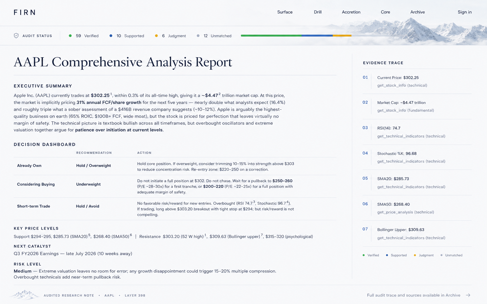
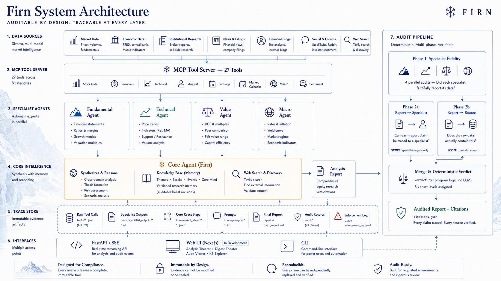
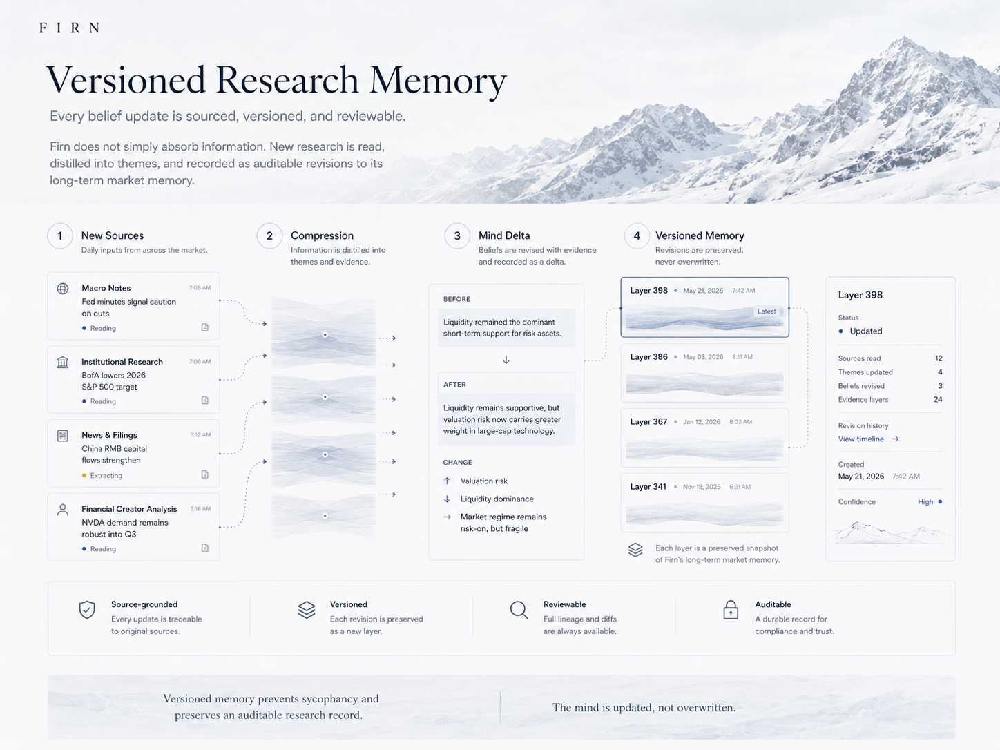
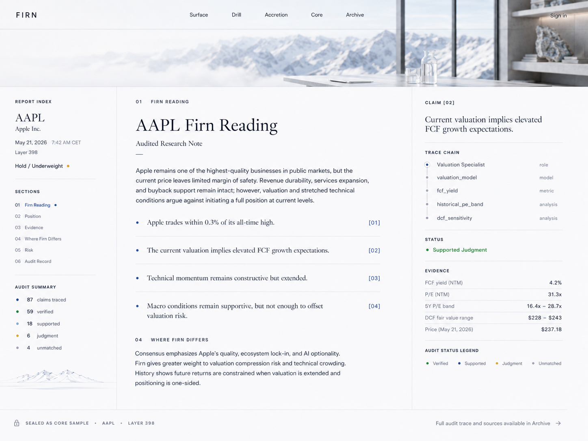

<p align="center">
  
</p>

<p align="center">
  <strong>Every claim traced. Every source verified. Every verdict deterministic.</strong>
</p>

<p align="center">
  <a href="#the-problem">The Problem</a> · <a href="#how-firn-audits">How Firn Audits</a> · <a href="#the-audit-pipeline">The Pipeline</a> · <a href="#system-architecture">Architecture</a> · <a href="#web-ui">Web UI</a> · <a href="#quick-start">Quick Start</a>
</p>

<p align="center">
  
  
  
  
  
</p>

---

## The Problem

AI agents are increasingly used to generate financial reports that humans act on. But every LLM output carries a fundamental risk: **hallucination**. A report that states "revenue grew 26% YoY" sounds authoritative — but did the model compute that from real data, or confabulate it?

You can't assign a human to audit every AI output — it's too expensive and defeats the purpose of automation. So most systems let the AI cite its own sources: tools like Deep Research, Gemini, and ChatGPT generate a report and attach their own citations in the same pass. The problem: the same model that might hallucinate the content is also providing the citations. When it says "Source: get_income_statement → $5.1B", you're trusting the model's claim about what it retrieved — not a verified record of what it actually retrieved.

A better approach: use an **independent audit agent** to verify the report after the fact. But this just moves the problem — the audit agent is itself an LLM, and it can fabricate evidence just as easily. Saying "I checked and it's correct" means nothing if the checking itself is unverifiable.

Firn solves this with **programmatic enforcement**: the audit agent searches for evidence, but every piece of evidence it attempts to record is **machine-verified against its actual search history** before being accepted. The agent cannot assert "I found this" — the system checks whether it actually searched for it, whether it quoted the report verbatim (not a paraphrase), and whether the specialist actually wrote what the agent claims. Every acceptance and rejection is logged — a compliance officer can review not just what passed, but what failed and why.

---

## How Firn Audits

The audit doesn't ask "is this report good?" — it asks, for each specific claim: **"where exactly did this number come from, and does the source actually say that?"**

An LLM audit agent searches for evidence. But the agent is **programmatically constrained** — it cannot record any evidence without the system independently verifying that evidence is real. The LLM finds; code verifies; deterministic logic judges.

<p align="center">
  
</p>

### What makes this different

**1. The auditor is itself audited — by code**

This is the core idea. An audit agent that can freely assert "I checked and it's correct" is no better than the agent it audits — it can hallucinate evidence just as easily. Firn solves this by constraining the audit agent at the tool level: every piece of evidence must pass three programmatic verification layers before being accepted.

<p align="center">
  
</p>

| Layer | What it checks | How |
|-------|---------------|-----|
| **Grep Evidence Verification** | "Did you actually search for this, or are you quoting from memory?" | Every `record_*()` call is cross-checked against the agent's real `grep_trace()` history. If the evidence text doesn't match any recent grep result → **rejected**. |
| **Report Text Verification** | "Does the sentence you're pointing to actually exist in the report?" | `claim_in_report` must be a normalized substring of the actual report. Paraphrases → **rejected**. |
| **Specialist Output Verification** | "Did the specialist actually say this?" | During the specialist fidelity phase, every claim attributed to a specialist is verified against the specialist's actual output file. Fabrications → **rejected**. |

All rejections are logged to `enforcement_log.jsonl` — a compliance officer can inspect not just what was accepted, but what was _rejected and why_.

**2. Full chain of custody**

Every citation in the final output includes the complete provenance chain:

```
Report: "trailing P/E of 18.9x"
  └─ Specialist (fundamental): "P/E Ratio: 18.9x (trailing)"
       └─ Tool call #1: get_stock_info(AAPL)
            └─ Raw API response: { "trailingPE": 18.923 }
```

This is not metadata — it's grep-verified evidence at every link. The chain terminates at raw API responses (yfinance, FRED, SEC filings) — that is the trust boundary. Firn verifies that the report faithfully represents what the data sources actually returned, not whether the data sources themselves are correct. Every layer above the raw data is auditable; the raw data is the ground truth.

**3. Deterministic verdicts, not LLM opinions**

The audit agent collects evidence. A separate program (`verdict.py`) assigns trust levels using deterministic rule-based logic — no LLM involved in the verdict decision. This means the verdict layer itself cannot hallucinate: given the same collected evidence, the same verdicts are produced every time. The LLM's role is strictly limited to _finding_ evidence; _judging_ it is done by code.

**4. Purpose-built search for financial data**

The audit agent searches evidence using `grep_trace` — a ripgrep-powered search tool inspired by Claude Code's grep implementation. Financial data appears in wildly different formats across the evidence chain: a report says "$5.1B", the specialist wrote "revenue $5.1B (+26.2% YoY)", and the raw API returned `{"totalRevenue": 5098000000}`. The tool supports full regex with OR alternatives (`"5.1|5098|5100"`) so the agent can bridge these format gaps in a single query.

Each grep result is automatically annotated with the originating tool call (`[@ tool_call #3: get_income_statement]`), giving the agent immediate provenance without manual cross-referencing. And every grep call is recorded — when the agent attempts to submit evidence, the system verifies it against actual grep history, closing the loop on fabrication.

---

## The Audit Pipeline

The audit runs in three phases. Each phase has a clear purpose, constrained scope, and machine-verified outputs.

<p align="center">
  
</p>

### Phase 1 — Specialist Fidelity: "Did each specialist faithfully report its data?"

Four parallel audit agents, one per specialist (fundamental, technical, value, macro). Each agent:

1. Reads the specialist's output (`trace/specialist_outputs/fundamental_output.md`)
2. For every factual claim, searches the specialist's raw tool data (`tools/fundamental_tool_calls.json`)
3. Records a fidelity verdict: **found** (grep matched), **derived** (inputs present, arithmetic by LLM), or **not-found**

```
Example — Specialist Fidelity Check:

  Specialist output:  "Current ratio improved to 1.47x from 1.32x"

  Agent searches:     grep_trace("1.47", "tools/fundamental_tool_calls.json")
  Grep result:        line 186: "currentRatio": 1.4692   [@ tool_call #3: get_financial_metrics]

  Agent searches:     grep_trace("1.32", "tools/fundamental_tool_calls.json")
  Grep result:        line 204: "currentRatio": 1.3218   [@ tool_call #3: get_financial_metrics]

  Verdict:            FOUND — both values trace to get_financial_metrics, tool call #3
```

**Enforcement**: The agent must paste actual grep output into `grep_evidence`. The tool programmatically verifies this matches the agent's grep history — fabricated evidence is rejected.

**Output**: `specialist_citations/{agent}.jsonl` — one entry per claim, with grep coordinates.

---

### Phase 2a — Report-to-Specialist Tracing: "Can each report claim be traced to a specialist?"

A single agent reads the final report and searches specialist outputs:

1. Identifies every factual claim in the report (numbers, dates, metrics, comparisons)
2. For each claim, greps all specialist outputs to find a match
3. Records the specialist excerpt and grep coordinates

**Scope constraint**: This agent can _only_ search `trace/specialist_outputs/` — it cannot access raw tool data. This forces a clean separation of evidence paths.

```
Example — Report-to-Specialist Trace:

  Report says:        "Revenue grew 26% YoY to $5.1B"

  Agent searches:     grep_trace("26%|5.1", "trace/specialist_outputs/")
  Match found in:     fundamental_output.md, line 51
  Specialist wrote:   "FY2025 revenue $5.1B (+26.2% YoY)"

  Record:             claim_in_report = "Revenue grew 26% YoY to $5.1B"  (exact substring from report)
                      specialist_excerpt = "FY2025 revenue $5.1B (+26.2% YoY)"  (exact substring from output)
```

---

### Phase 2b — Report-to-Source Tracing: "Does the raw data actually contain this?"

A separate agent (running in parallel with 2a) reads the same report but searches raw tool data:

1. For each factual claim, greps all tool call JSON files
2. Handles number format variations (report: "$5.1B" → raw: `5100000000`)
3. Records the raw value, source tool, and grep coordinates

**Scope constraint**: This agent can _only_ search `tools/` — it cannot access specialist outputs. Two independent evidence paths, zero cross-contamination.

```
Example — Report-to-Source Trace:

  Report says:        "Revenue grew 26% YoY to $5.1B"

  Agent searches:     grep_trace("5.1|5100", "tools/")
  Match found in:     tools/fundamental_tool_calls.json, line 42
  Raw data:           "totalRevenue": 5098000000   [@ tool_call #2: get_income_statement]

  Record:             raw_value = "5098000000"
                      source_tool = "get_income_statement"  (auto-resolved from grep coordinates)
```

---

### Verdict Merge — Deterministic, No LLM

After Phase 2a and 2b complete, `verdict.py` merges their outputs using program logic:

```python
# Simplified verdict logic — no LLM, no temperature, no sampling

# 1. Special source types take priority
if source_type == "kb":
    verdict = "kb-sourced"            # Traced to knowledge base
elif source_type == "web":
    verdict = "web-sourced"           # Traced to web search
elif source_type in ("computation", "derived"):
    verdict = "computed"              # Deterministic calculation (e.g., reverse DCF)

# 2. Combined evidence rules
elif has_specialist and r1_fidelity == "found":
    verdict = "verified"              # R2a + R1: report → specialist → raw data
elif has_source or has_specialist:
    if has_specialist and not has_source and r1_fidelity != "found":
        verdict = "specialist-judgment"  # Specialist claimed it, weak data backing
    else:
        verdict = "supported"         # Partial evidence chain present
else:
    verdict = "unverified"            # No evidence found anywhere
```

### Six Trust Levels

<p align="center">
  
</p>

| Verdict | Meaning | Trust | Example |
|---------|---------|-------|---------|
| **Verified** | Full chain via R2a + R1: report → specialist → raw data | Highest | "P/E of 18.9x" — specialist stated it, R1 confirmed it traces to raw API data |
| **Supported** | Partial evidence chain — raw data or specialist trace present | High | "Revenue $5.1B" — found in raw data (R2b), but specialist chain incomplete |
| **KB-Sourced** | Traced to knowledge base entry | High | "Uranium supply squeeze" — from KB themes/uranium-supply |
| **Computed** | Result of deterministic calculation | Medium-High | "Implied growth 9.2%" — from reverse DCF sidecar |
| **Web-Sourced** | Traced to web search result | Medium | "CEO appointed May 2026" — from web_search result |
| **Specialist Judgment** | Only specialist stated it, no raw data | Medium | "Fair value ~$150" — specialist's DCF estimate |
| **Unverified** | No evidence found in any source | None | Claim exists in report but cannot be traced |

### What you actually get

The verdict label is a summary — the real output is a **structured citation per claim** containing the complete evidence package.

<p align="center">
  
  <br/><em>Audited report with evidence trace — every claim linked to its source data</em>
</p>

In the web UI, citations appear as inline highlights on the report text. Hover any highlighted number to see its full evidence chain:

```
  Report text (with audit overlay active):

  "...Alphabet trades at a trailing P/E of 18.9x⁷, near its
  5-year median of 24.2x⁸. Free cash flow reached $62.25⁹..."
                                            ─────
                                              ↓ hover
                                ┌─────────────────────────┐
                                │ ✓ Verified               │
                                │                          │
                                │ "trailing P/E of 18.9x"  │
                                │                          │
                                │ Source: get_stock_info    │
                                │ = 18.923                 │
                                │                          │
                                │ Specialist (fundamental): │
                                │ "P/E Ratio: 18.9x        │
                                │  (trailing)"             │
                                └─────────────────────────┘
```

Each highlighted number links to a structured citation. Here is the underlying data for citation ⁷ above:

```json
{
  "id": 7,
  "claim": "Trailing P/E of 18.9x",
  "claim_in_report": "trailing P/E of 18.9x",
  "verdict": "verified",
  "source": {
    "agent": "fundamental",
    "tool": "get_stock_info",
    "index": 1,
    "raw_value": "18.923"
  },
  "specialist": {
    "agent": "fundamental",
    "excerpt": "P/E Ratio: 18.9x (trailing)"
  },
  "evidence": {
    "source_grep": "tools/fundamental_tool_calls.json:42: \"trailingPE\": 18.923  [@ tool_call #1: get_stock_info]",
    "specialist_grep": "trace/specialist_outputs/fundamental_output.md:15: P/E Ratio: 18.9x (trailing)"
  },
  "r1_match": {
    "agent": "fundamental",
    "claim_id": 3,
    "verdict": "found",
    "source_tool": "get_stock_info",
    "source_index": 1
  }
}
```

Every claim gets this treatment — not just a color label, but the exact specialist quote, the exact raw API value, the grep coordinates where evidence was found, and the R1 cross-reference confirming the specialist faithfully reported its data. A compliance officer can trace any number in the report back to the API response that produced it.

---

## What the Audit Agent Sees

Transparency matters. Here is exactly what the audit agent has access to — and what it doesn't.

### Trace directory structure (generated per analysis)

```
logs/{execution_id}/
├── reports/
│   └── final_report.md              ← The report being audited
├── trace/
│   ├── specialist_outputs/
│   │   ├── fundamental_output.md     ← What each specialist wrote
│   │   ├── technical_output.md
│   │   ├── value_output.md
│   │   └── macro_output.md
│   ├── react_steps/                  ← Full reasoning chains (think → tool → observe)
│   │   ├── fundamental_steps.jsonl
│   │   └── core_analysis_steps.jsonl
│   └── prompts/                      ← Exact prompts sent to each agent
│       ├── fundamental_system.txt
│       └── core_analysis_user.txt
├── tools/
│   ├── fundamental_tool_calls.json   ← Raw API responses (every tool call, full I/O)
│   ├── technical_tool_calls.json
│   ├── value_tool_calls.json
│   ├── macro_tool_calls.json
│   └── core_analysis_tool_calls.json ← Core agent's KB reads, web searches
└── audit/                            ← Audit outputs (written during audit)
    ├── citations.json                ← Final structured citations for UI
    ├── enforcement_log.jsonl         ← All rejected evidence attempts
    ├── specialist_citations/         ← Phase 1 outputs
    ├── specialist_evidence.jsonl     ← Phase 2a outputs
    └── source_evidence.jsonl         ← Phase 2b outputs
```

### Scope constraints per phase

| Phase | Can search | Can read | Cannot access |
|-------|-----------|----------|---------------|
| Phase 1 (per specialist) | That specialist's `tools/*.json` | That specialist's output | Other specialists' data |
| Phase 2a | `trace/specialist_outputs/` only | `report.md` only | `tools/` (raw data) |
| Phase 2b | `tools/` only | `report.md` only | `trace/specialist_outputs/` |

This separation ensures Phase 2a and 2b provide **independent evidence paths** — their outputs are only combined by deterministic program logic in the verdict merge.

---

## System Architecture

<p align="center">
  
</p>

### Analysis Pipeline

```
User: "Analyze AAPL"
    │
    ├─→ Fundamental Agent ──→ earnings, revenue, cash flow, balance sheet
    ├─→ Technical Agent   ──→ price trends, indicators, support/resistance
    ├─→ Value Agent       ──→ valuation multiples, DCF, peer comparison
    └─→ Macro Agent       ──→ rates, inflation, market regime, yield curve
                                │
                    ┌───────────┘
                    ▼
              Core Agent (Firn)
              + Knowledge Base context
              + Web search capability
                    │
                    ▼
            Comprehensive Report
                    │
                    ▼
          ┌─── Audit Pipeline ───┐
          │ Phase 1: Fidelity    │
          │ Phase 2a: Specialist │
          │ Phase 2b: Source     │
          │ Merge: Verdicts      │
          └──────────────────────┘
                    │
                    ▼
          Audited Report + Citations
```

### Versioned Research Memory

Firn maintains a persistent, auditable knowledge base — every belief update is sourced, versioned, and reviewable.

<p align="center">
  
</p>

New information is read, compressed into themes, and recorded as auditable revisions to the agent's long-term structured memory. The knowledge base maintains separate sections for the agent's own views, user-provided views, and points of divergence between the two — a structural defense against LLM sycophancy that keeps analysis grounded in accumulated evidence rather than user expectations.

After 5 months and 400+ articles across 96 training epochs, the knowledge base represents a compressed, structured understanding of markets. The mind is updated, not overwritten — every revision is traceable to its source.

### The Glacier Metaphor

The name **Firn** comes from glaciology — it's the intermediate stage between fresh snow and glacier ice, where each year's snowfall compresses into a denser, more permanent layer.

| Concept | Firn Mapping |
|---------|-------------|
| Fresh snow | New data — articles, market feeds, macro indicators |
| Compression into firn | Digest processing — reading, evaluating, synthesizing |
| Ice layers (strata) | Knowledge base — structured, persistent, layered by time |
| Drilling an ice core | Analysis — penetrating through accumulated knowledge |
| Air bubbles in ice | Audit trail — each claim permanently traceable to its source |
| Reading the core | Verification — inspecting what was sealed at each layer |

---

## Roadmap

- [x] Multi-agent analysis pipeline (4 specialists + core synthesis)
- [x] MCP data server (27 tools, 7 data sources)
- [x] 3-phase audit pipeline with deterministic verdicts
- [x] Versioned research memory (digest pipeline + 96 training epochs)
- [x] FastAPI backend with SSE streaming
- [x] Web UI — functional version with Analysis Theater, Digest Theater, KB Explorer
- [x] 1,000+ automated tests
- [ ] **Firn UI v2** — editorial glacier-aesthetic redesign (in progress, ETA ~1 week)
- [ ] Full data connection (typed API client, real-time data flow)
- [ ] Deployment guide (Docker, cloud)

---

## Web UI

The included `web-ui/` is a fully functional Next.js interface that connects to the backend API. It features:

- **Analysis Theater** — real-time React Flow DAG visualization of the multi-agent pipeline
- **Digest Theater** — immersive 3-zone view of knowledge accumulation (reading stack, Firn presence, knowledge strata)
- **KB Explorer** — browse the agent's notebook, themes, stock notes, and core worldview
- **Audit Citations** — view per-claim verdicts overlaid on the analysis report

### Firn UI v2 (Coming Soon)

An editorial-grade redesign is in active development — glacier-inspired visual language with light backgrounds, serif headlines, and generous whitespace. Designed as a reading experience rather than a dashboard.

<p align="center">
  
  <br/><em>Homepage — glacier photography, editorial typography, analysis input</em>
</p>

<p align="center">
  
  <br/><em>Audited research note — inline citation markers linked to evidence chain</em>
</p>

<p align="center">
  
  <br/><em>Archive — sealed core samples with claim counts, verification stats, and immutable records</em>
</p>

---

## Tech Stack

| Layer | Technology | Details |
|-------|-----------|---------|
| **Agent Framework** | LangGraph | Multi-agent orchestration, parallel fan-out/fan-in, ReAct loops |
| **Data Tools** | MCP (Model Context Protocol) | 27 tools across 10 modules — stdio transport, TTL cache |
| **Data Sources** | yfinance, FRED, StockTwits, Reddit, Tavily, + pluggable scrapers | Market data, macro, sentiment, analyst research, financial blogs |
| **LLM** | Multi-provider | DeepSeek, Gemini, Claude — provider-agnostic design |
| **API** | FastAPI | SSE streaming, cookie auth, execution traces |
| **Knowledge Base** | File-based (Markdown + YAML) | Persistent, git-trackable, human-readable |
| **Frontend** | Next.js 16, React 19, Tailwind v4 | Editorial glacier aesthetic (in development) |
| **Testing** | pytest | 1,000+ tests (880 agent + 138 MCP) |

### By the Numbers

| Metric | Value |
|--------|-------|
| Agent tools | 47 (27 MCP + 10 KB + 2 Web + 8 Audit) |
| Automated tests | 1,000+ |
| Audit trust levels | 6 (deterministic classification) |
| Specialist agents | 4 (parallel execution) |
| Knowledge articles | 400+ (across 96 training epochs, 5 months) |
| Audit verification rate | 91.4% verified+supported (GOOG benchmark) |
| Agent code | ~20,000 lines Python |
| MCP server code | ~7,300 lines Python |

---

## Quick Start

### Prerequisites

- Python 3.12+
- [uv](https://docs.astral.sh/uv/) (Python package manager)
- Node.js 20+ and pnpm (for frontend)
- API keys: at minimum one LLM provider (DeepSeek/Gemini/Anthropic) + FRED

### Setup

```bash
# Clone the repository
git clone https://github.com/M-HuangX/Firn.git
cd firn

# Install agent dependencies
cd global-market-agent
uv sync

# Configure environment
cp .env.example .env
# Edit .env with your API keys (see .env.example for all options)

# Install MCP server dependencies
cd ../global-market-mcp
uv sync

# Install frontend dependencies
cd ../web-ui
pnpm install
```

### Run an Analysis

```bash
cd global-market-agent

# Analyze a stock
uv run python -m src --ticker AAPL

# Analyze with automatic audit
uv run python -m src --ticker AAPL --with-audit

# Audit a previous analysis
uv run python -m src --audit latest

# Run the digest pipeline (process new articles)
uv run python -m src --digest

# Check system status
uv run python -m src --status
```

### Start the Web UI

```bash
# Terminal 1: Start the API server
cd global-market-agent
uv run uvicorn src.api.app:app --host 0.0.0.0 --port 8000

# Terminal 2: Start the frontend
cd web-ui
pnpm dev
# Open http://localhost:3000
```

### Run Tests

```bash
# Agent tests (880+)
cd global-market-agent && uv run pytest

# MCP server tests (138+)
cd global-market-mcp && uv run pytest

# Frontend tests
cd web-ui && npx vitest run
```

---

## Project Structure

```
firn/
├── global-market-agent/          # LangGraph multi-agent system
│   ├── src/
│   │   ├── agents/               # 4 specialists + core agent + filter
│   │   ├── audit/                # 3-phase audit pipeline (the core innovation)
│   │   ├── knowledge_base/       # Persistent KB with 10 tools
│   │   ├── sources/              # Data ingestion (pluggable scrapers)
│   │   ├── api/                  # FastAPI + SSE streaming
│   │   └── utils/                # Execution logger, context manager
│   └── tests/                    # 880+ tests
├── global-market-mcp/            # MCP data server
│   ├── src/                      # 27 tools across 10 modules
│   └── tests/                    # 138+ tests
└── web-ui/                       # Next.js frontend (functional + v2 redesign in progress)
```

---

## License

This project is licensed under the [GNU Affero General Public License v3.0](LICENSE) — you are free to use, modify, and distribute this software. If you deploy a modified version as a network service, you must make the source code available under the same license.

For commercial licensing inquiries, please contact xin.huang@epfl.ch.

---

<p align="center">
  <em>Named after firn — compacted snow on its way to becoming glacier ice.<br/>Each layer preserves what fell. Each bubble seals the air of its time.<br/>Firn builds knowledge the same way: layer by layer, verifiable to the core.</em>
</p>
